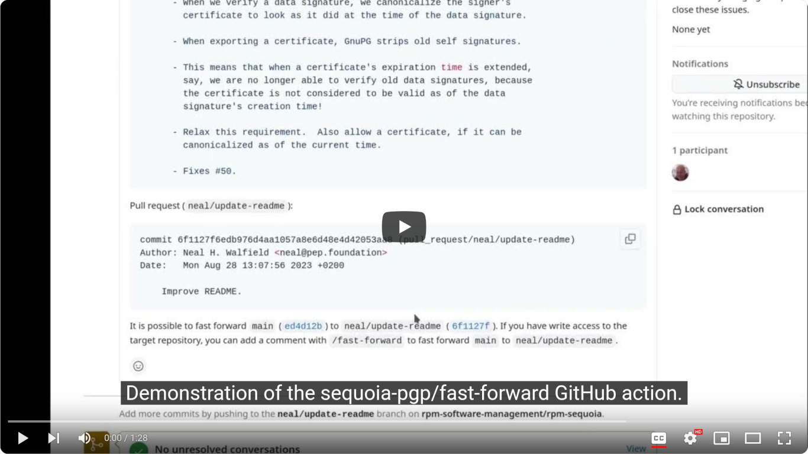

# Fast Forward Pull Requests

This repository contains a GitHub action that merges a pull request by
fast forwarding the target branch.  The action is triggered when an
authorized user adds a comment containing `/fast-forward` to the pull
request.

[](https://www.youtube.com/watch?v=AXUtUdH6zrw)

The ability to fast forward a branch (the equivalent of doing `git
merge --ff-only`) is needed to have an *unmodified*, linear history.
More perspectives on the usefulness of fast forwarding are presented
in [this GitHub
discussion](https://github.com/orgs/community/discussions/4618).

Unfortunately, it is not currently possible to fast forward a branch
using GitHub's web UX.  GitHub's web UX allows the user to select from
several different merge strategies, but none of the strategies fast
forward the target branch even when fast forwarding is possible.


The closest sounding merge strategy is `Rebase and merge`.  But, it
[unconditionally rewrites the commits by changing each commit's
`committer`
field](https://docs.github.com/en/repositories/configuring-branches-and-merges-in-your-repository/configuring-pull-request-merges/about-merge-methods-on-github#rebasing-and-merging-your-commits).
That is, it does the equivalent of `git rebase --no-ff`.  This results
in the commits having a different hash, and destroys any signatures.

With a bit of work, it is possible to prevent GitHub from modifying
the commits.  Specifically, it is possible to push changes from a pull
request directly to the target branch after any checks have passed.
Consider:

```shell
$ # We can't directly push to main, because it is protected.
$ git push origin
...
remote: error: GH006: Protected branch update failed for refs/heads/main.
...
$ # We can create a PR, wait for the CI checks to pass, then push directly to main.
$ git push origin HEAD:workwork
$ git push origin
```

But, this approach isn't very convenient.

The `fast-forward` action improves the situation a bit by making it
possible to fast forward directly from the web UX by posting a comment
on the pull request.

See the GitHub Marketplace for [other actions that do something
similar](https://github.com/marketplace?type=actions&query=fast+forward).

## Checking if Fast Forwarding is Possible

By default the `fast-forward` action checks if a pull request can be
merged.  It adds a comment to the pull request indicating if this is
the case, or if the pull request needs to be rebased.  When the target
branch can't be fast forwarded, the action fails.  If the target
branch is protected, this prevents the branch from being merged, which
is normally desired.

To run this check whenever a pull request is opened or updated, add
`.github/workflows/pull_request.yml` to your repository with the
[following contents](.github/workflows/pull_request.yml):

```yaml
name: pull-request
on:
  pull_request:
    types: [opened, reopened, synchronize]
jobs:
  check-fast-forward:
    runs-on: ubuntu-latest

    permissions:
      contents: read
      # We appear to need write permission for both pull-requests and
      # issues in order to post a comment to a pull request.
      pull-requests: write
      issues: write

    steps:
      - name: Checking if fast forwarding is possible
        uses: sequoia-pgp/fast-forward@v1
        with:
          merge: false
          # To reduce the workflow's verbosity, use 'on-error'
          # to only post a comment when an error occurs, or 'never' to
          # never post a comment.  (In all cases the information is
          # still available in the step's summary.)
          comment: always
```

Note: this will only work after the fast-forward action has been
merged into the default branch.

## Fast Forwarding a Pull Request

To actually fast-forward a branch, add
`.github/workflows/fast-forward.yml` to your repository with the
[following contents](.github/workflows/fast-forward.yml):

```yaml
name: fast-forward
on:
  issue_comment:
    types: [created, edited]
jobs:
  fast-forward:
    # Only run if the comment contains the /fast-forward command.
    if: ${{ contains(github.event.comment.body, '/fast-forward')
            && github.event.issue.pull_request }}
    runs-on: ubuntu-latest

    permissions:
      contents: write
      pull-requests: write
      issues: write

    steps:
      - name: Fast forwarding
        uses: sequoia-pgp/fast-forward@v1
        with:
          merge: true
          # To reduce the workflow's verbosity, use 'on-error'
          # to only post a comment when an error occurs, or 'never' to
          # never post a comment.  (In all cases the information is
          # still available in the step's summary.)
          comment: always
```

This workflow is only run when a comment that includes `/fast-forward`
is added to the pull request.  The workflow is careful to check that
the user who triggered the workflow is actually authorized to push to
the repository.

Note: this will only work after the fast-forward action has been
merged into the default branch.

## Disabling Comments

If you prefer to disable comments, you can set the `comment` input
variable to `false`.  The `comment` is also written to the `comment`
output variable so it is possible to use it in a successive step.  The
format is a JSON document with a single key, `body`.  Here's an
example:

```yaml
name: pull-request
on:
  pull_request:
    types: [opened, reopened, synchronize]
jobs:
  check-fast-forward:
    runs-on: ubuntu-latest

    permissions:
      contents: read
      # We appear to need write permission for both pull-requests and
      # issues in order to post a comment to a pull request.
      pull-requests: write
      issues: write

    steps:
      - name: Checking if fast forwarding is possible
        id: fast-forward
        uses: sequoia-pgp/fast-forward@v1
        with:
          comment: false
      - name: Display comment
        env:
          COMMENT: ${{ steps.fast-forward.outputs.comment }}
        run: echo "The comment is... $COMMENT"
```

This would display something like:

```text
The comment is... {
  "body": "..."
}
```

Additional fields may be added to the JSON document in the future.

## Troubleshooting

### My GitHub Actions don't run after I fast-forward a PR


With the standard `GITHUB_TOKEN`, after a fast-forward succeeds, no workflows will be triggered. This may be confusing as the user might expect their CI/CD to trigger on any push to `main` for example.

The issue stems from GitHub not triggering Actions on events created with `GITHUB_TOKEN` to avoid recursive worflows. From GitHub's [docs](https://docs.github.com/en/actions/using-workflows/triggering-a-workflow#triggering-a-workflow-from-a-workflow):

> When you use the repository's `GITHUB_TOKEN` to perform tasks, events triggered by the `GITHUB_TOKEN`
> will not create a new workflow run. This prevents you from accidentally creating recursive workflow runs.

A solution is to use a [Personal Access Token](https://docs.github.com/en/authentication/keeping-your-account-and-data-secure/creating-a-personal-access-token) in the fast-forward step if you want GitHub Actions CI checks to run on the base branch after it gets fast-forwarded:
```yaml
      - name: Fast forwarding
        uses: sequoia-pgp/fast-forward@v1
        with:
          github_token: ${{ secrets.PERSONAL_ACCESS_TOKEN }}
          # your other configs...
```

The generated PR comments will then appear as if they were written by the owner of the personal access token, and the fast-forward will appear is if performed by that owner. 
